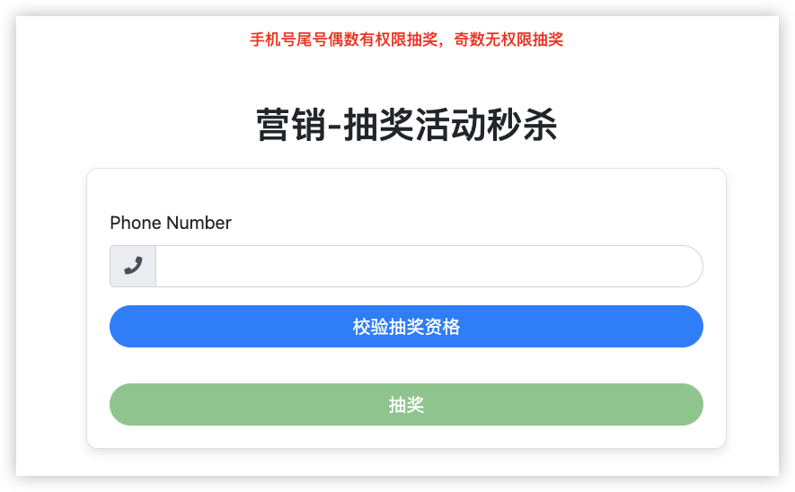
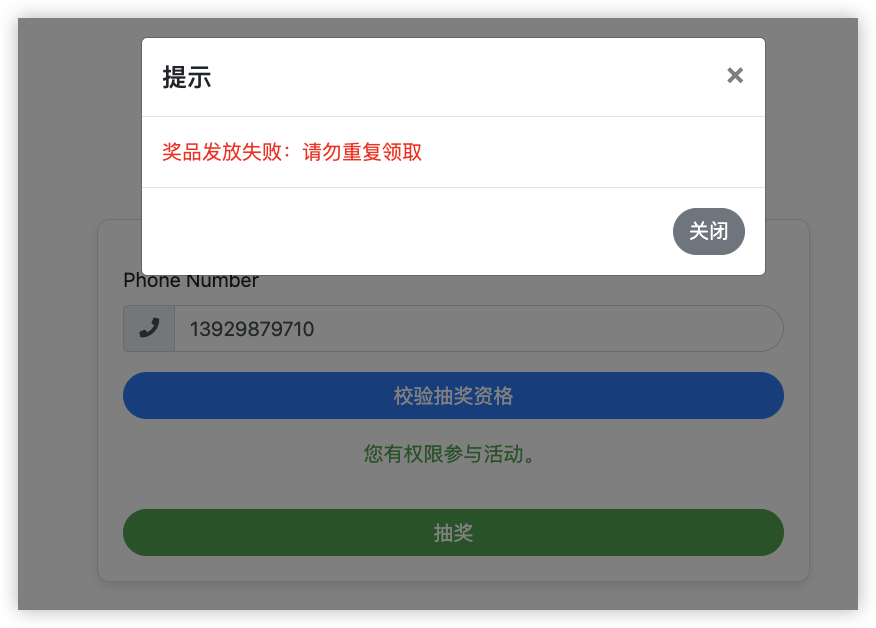
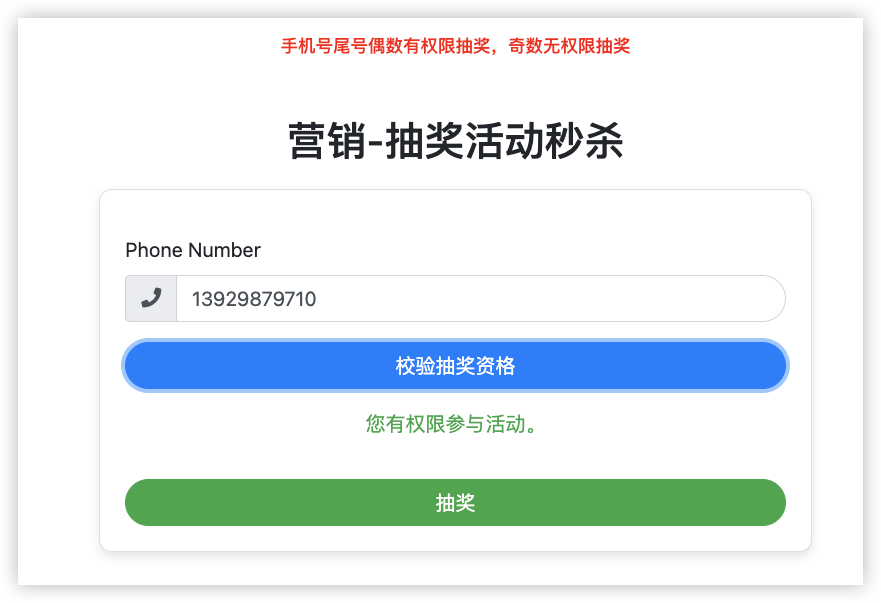
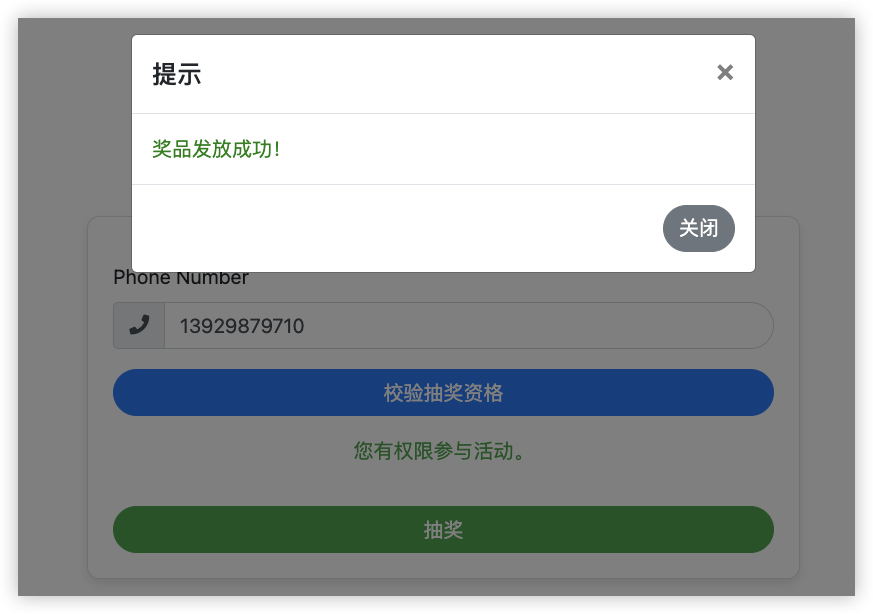
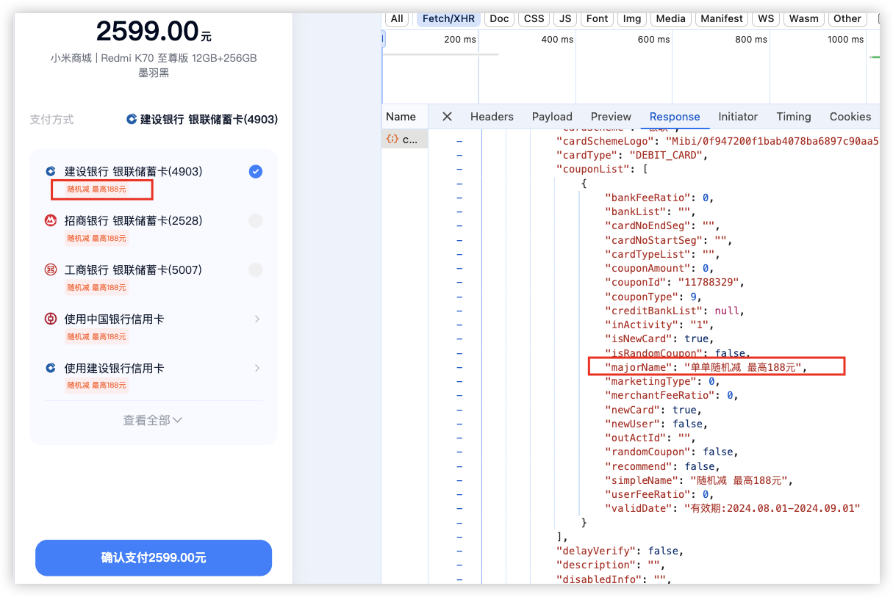

# 如何使用
1. 首先创建数据库表 [marketing.sql](src%2Fmain%2Fresources%2Fmarketing.sql)
2. git clone下项目
3. 直接使用idea打开
4. 补充mysql用户名密码，redis用户名密码 [application.properties](src%2Fmain%2Fresources%2Fapplication.properties)
5. 请求MarketingActivityController 校验抽奖资格 + 进行抽奖

# [点我 - 体验地址](https://www.gdufe888.top/marketing/rule/check)
此前端页面完全是用GPT生成的，感谢GPT的贡献，远远提高了我的生产力


 
 
 
 

# 前言
这几年工作中做过不少营销活动，无论是电商业务、支付业务、还是信贷业务，营销在整个业务发展过程中都是必不可少的。如果前期营销宣传到位，会给业务带来一波不小的流量。那么作为技术，如何接住这波流量，而不是服务被打挂。今天大厂员工，手把手教你开发出一个高并发、高可用的营销活动。


# 业务
任何脱离业务的技术都是无用功，所以我们先简单介绍一下业务。

业务希望我们的用户在比如购买商品，下单支付等场景，转化率尽可能的高。那么为了奖励和刺激用户，**我们希望通过一些优惠券的方式**，来激励符合我们规则的用户，进行下单，进行支付，进行借钱，进行购物等等后续操作。

比如某个用户符合我们活动的规则，第一步我们会给他展示优惠信息，激励他来进行下一步、完成这个任务，然后在给他发奖、核销等后续动作



# 校验抽奖资格
那么根据以上我们业务的分析，我们第一步就是，用户进来，我们查询活动，并且校验用户是否有资格参加活动。如果有多个活动，我们根据业务规则选择一个活动让用户进行参与。

那么这也是我们营销活动的起点，第一步。如果成千上百万的用户一下子涌进来，我们去查询数据库活动信息，并且校验规则，我们的数据库瞬间就会崩掉。所以我们的核心思路是：**逐级分流，逐步分散流量**。通过**备份、限流、降级、熔断**等手段提升可用性。

首先就是加缓存，对于一些静态页面，css，js等文件，可以放在客户端缓存或者CDN里面。对于活动信息以及规则，在活动上线之前，将这些信息缓存到redis里面。用户进来时，我们直接取redis里面查询活动信息，并且计算活动规则，全程不需要和数据库进行交互。最后，评估活动qps，进行降级限流，如果流量过大，直接进行拦截，防止系统雪崩。

```java
public MktActivityInfo checkActivityRule(String phone) {
    // 从redis缓存中取
    MktActivityInfo activityInfo = activityCacheService.getActivityInfo();
    if (activityInfo == null || StringUtils.isEmpty(activityInfo.getActivityId())) {
        return null;
    }

    ActivityRuleContext context = new ActivityRuleContext();
    context.setPhone(phone);
    // redis缓存中取
    List<MktActivityRule> mktActivityRules = activityCacheService.listActivityRule(activityInfo.getActivityId());
    for (MktActivityRule mktActivityRule : mktActivityRules) {
        BaseRuleService baseRuleService = BaseRuleFactory.getBaseRuleService(mktActivityRule.getRuleKey());
        if (baseRuleService == null || !baseRuleService.check(context)) {
            return null;
        }
    }

    return activityInfo;
}
```

# 抽奖
一般到达抽奖，基本都是完成了前面的任务，比如支付，下单等等，最终获得抽奖资格

1. 减库存。将奖品的库存信息提前缓存到redis里面，比如奖品100个缓存到redis里面。如果有100W人来抢100个奖品，最终也只有100个人通过redis的校验
```java
Long num = RedisUtils.decr(CACHE_MKT_ACTIVITY_PRIZE_NUM, stringRedisTemplate);
if (num == null || num < 0) {

    // 将redis库存加回，可做可不做，看业务需求
    RedisUtils.incr(CACHE_MKT_ACTIVITY_PRIZE_NUM, stringRedisTemplate);
    throw new RuntimeException("redis库存不足 - " + ERROR_MSG);
}
```

2. 根据业务场景，如果不是必中奖。在减库存之前，做一个随机数。如果在随机数之外，直接返回”奖品被抢完“，限制大部分流量进入到redis减库存
```java
int seed = ThreadLocalRandom.current().nextInt(0, 100) + 1; // 1-100
int random = NumberUtils.toInt(RedisUtils.get(CACHE_MKT_ACTIVITY_PRIZE_RANDOM, stringRedisTemplate));
if (seed > random) {
    //log.warn("随机比例被拦截 seed = {}, random = {}", seed, random);
    throw new RuntimeException("随机比例拦截 - " + ERROR_MSG);
}
```

3. 放弃重试
   失败重试会影响系统性能，重试次数越多，对系统性能的影响越大。
   抽奖过程中，从抽奖信息验证到扣库存、中奖信息入库的整个过程中，任何一个环节异常或失败，我们都不会进行重试，全部当做未中奖处理

4. 防止奖品超发
   一般我们会通过乐观锁，悲观锁，分布式锁来解决。其中乐观锁的效率是最高的。
   下面sql不是标准的乐观锁，标准的乐观锁使用一个version字段来判断。不过下面的sql能很好的解决乐观锁容易失败的弊端

```sql
update mkt_activity_prize set num = num - 1 where num  >= 1
```
```java
// 4. 真正数据库减库存，并且插入发奖记录
// 如果redis预减库存成功，这里大概率会成功，基本不会失败，如果失败，放弃重试，失败重试会影响系统性能，重试次数越多，对系统性能的影响越大。
Boolean execute = transactionTemplate.execute(status -> {
    // 4.1 扣减库存
    Integer update = mktActivityPrizeDao.occupyActivityPrize(activityPrize.getActivityId(), activityPrize.getPrizeId());
    if (update == null || update <= 0) {
        //log.warn("mysql 扣减库存失败 update = {}", update);
        throw new RuntimeException("mysql库存扣减失败 - " + ERROR_MSG);
    }

    // 4.2 插入发奖记录
    MktActivityPrizeGrant grant = buildMktActivityPrizeGrant(phone, activityPrize);
    Integer insert = mktActivityPrizeGrantDao.insert(grant);
    if (insert == null || insert <= 0) {
        //log.warn("mysql 插入发奖记录失败 insert = {}", insert);
        throw new RuntimeException("mysql 插入发奖记录失败 - " + ERROR_MSG);
    }

    return true;
});
```

那么从以上几个步骤我们可以看出，在真正的数据库减少库存的时候，随机拦截 + redis减库存已经帮我们拦截了大部分流量了，也就只有少部分流量会进入到我们真正的减库存环节。如果减库存的流量还是特别的大，我们还可以调整随机比列，同时减库存可以放到mq中，直接异步化发放奖品，基本少整个流程不会与数据库进行交互，瓶颈点几乎可以说是没有。这种架构，支撑百万，千万qps一点问题都没有。


# 最后
本文根据真实的业务场景，详细的剖析了一场营销活动从技术的角度如何设计规划，做到真正的高并发，高可用，支撑业务稳定的运行。其中涉及到的技术点还是比较多的，很多细节没有一一列举，包括如何保证redis库存和mysql一致，如果业务在活动中想修改库存怎么办，怎么保证不重复领取等等问题。
强烈建议大家有空可以自己实现一版，其中的一些细节还是非常考验技术的，实现下来，一定会有不少的收获，谢谢大家。


